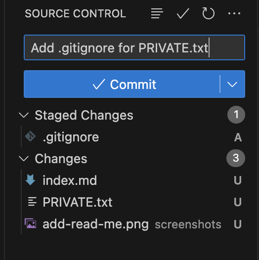
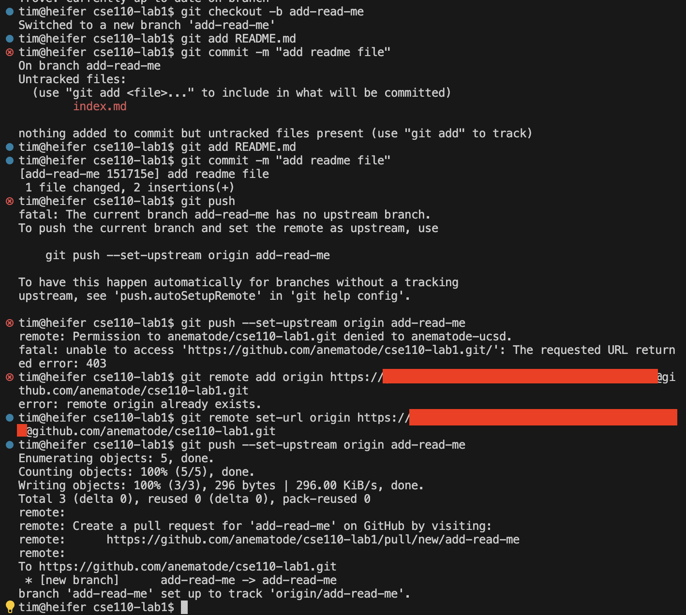

# Some pictures

Here is me adding the .gitignore in VS Code. This is the *add-gitignore* branch.



Here is me adding the README from the command line. This is the *add-read-me* branch.



## How
### far
#### do
##### headers
###### go?

## Emphasis changes meaning

* *I* never said he stole your money.
* I **never** said he stole your money.
* I never ***said*** he stole your money.
* I never said `he` stole your money.

1. I never said he <ins>stole</ins> your money.
2. I never said he stole "your" money.
3. I never said he stole your <del>money</del>.

## Commentary on C++

<a name="cpp"></a>Do you *really* know C++ if you don't immediately understand why

```cpp
int main() {
    ([&](){([&](){})()})();
}
```

compiles with no warnings?

## External links

[The UCSD website](https://ucsd.edu/) has a larger footprint than [Google Maps](https://maps.google.com).

## Section link

Please re-read the [C++ wisdom](#cpp).

## README

The readme is located at [README.md](./README.md).

## Tasks for today

- [x] Live
- [ ] Laugh
- [x] Love